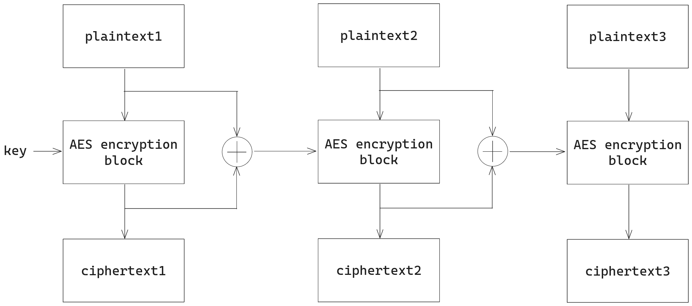

## \[crypto] Favourite Message
> Expected Difficulty: 1

This is a challenge about AES and [block cipher mode of operations](https://en.wikipedia.org/wiki/Block_cipher_mode_of_operation).

In most AES CTF challenges, you can treat the AES cipher as a secure black box, and in this challenge, we also assume that AES itself is secure.

AES splits the plaintext into blocks of 16 bytes, and encrypt each of them separately. To avoid the same message being encrypted to the same ciphertext in different blocks, we usually use mode of operations to securely link the blocks together.

In this challenge, we can look at how the message is encrypted.

```python
def encrypt_block(self, block):
	cipher = AES.new(self.key, AES.MODE_ECB)
	return cipher.encrypt(block)

def encrypt(self, message):
	assert len(message) % 16 == 0
	blocks = [message[i : i + 16] for i in range(0, len(message), 16)]
	encrypted_message = b""
	for plaintext in blocks:
		ciphertext = self.encrypt_block(plaintext)
		self.key = xor(plaintext, ciphertext)
		encrypted_message += ciphertext
	return encrypted_message
```
The encrypt block function is simply invoking the ECB mode of AES to encrypt a block. This means the block is simply encrypted with the plain AES cipher without any additional processing.

We can see the message is being split into blocks, and each block is encrypted separately and then combined together later.

To look at the mode of operations, we should have a look at how different blocks interact with each other in the encryption process.

A visualization helps us understand how the blocks are linked together:


The + sign in a circle means xor operation.

Notice that the plaintext is controlled by us, and the ciphertext is given to us. The key is not given to us, but after one block, the key is updated using the xor of the plaintext and ciphertext. We know both and can compute the new key by ourselves.

This means that we cannot decrypt the first block of the ciphertext, but we can decrypt all the blocks later.

We can decrypt a ciphertext if we have the key and the ciphertext.

Also note that even if part of the plaintext is unknown due to it being the flag, we can still get the whole plaintext since by the time we need the plaintext of this block to compute the key of the next block, we already have the plaintext of this block since it is decrypted by the previous block.

In other words, this mode of operation has almost no security (except for the first block).

Solve script:

```python
from pwn import *
from Crypto.Cipher import AES

with remote("localhost", 25040) as io: # Change to the appropriate host and port
    io.sendlineafter(b"Tell me your favourite message: ",b"0" * 16 + b"{flag}")
    io.recvuntil(b"\nUwU ")
    c = bytes.fromhex(io.recvline().strip().decode())
    key = xor(b"0" * 16, c[:16]) # Pad 16 0s to be the first block.
    m = b""
    for i in range(16, len(c), 16):
        cipher = AES.new(key, AES.MODE_ECB)
        block = c[i : i + 16]
        b = cipher.decrypt(block)
        m += b
        key = xor(b, block)
    print(m)
```

Umm... Yes, the UwU in the challenge has nothing to do with the solution.

Flag: **`cuhk25ctf{I_gu3s5_S7ick_70_u51ng_s7andard_m0d3s_i5_b3tter_7han_designiNg_0ur_Own_CRYpto}`**