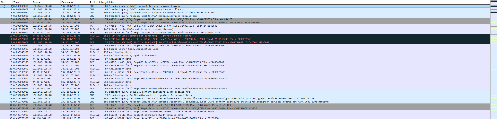
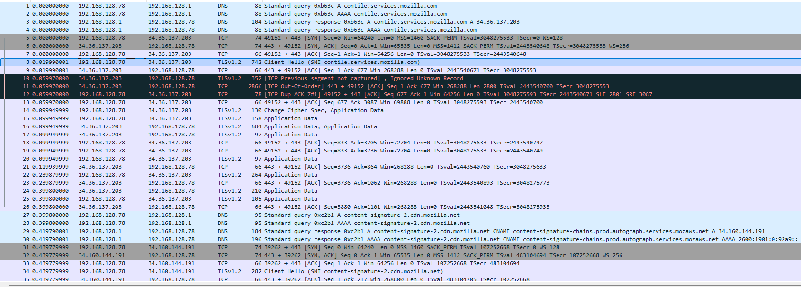
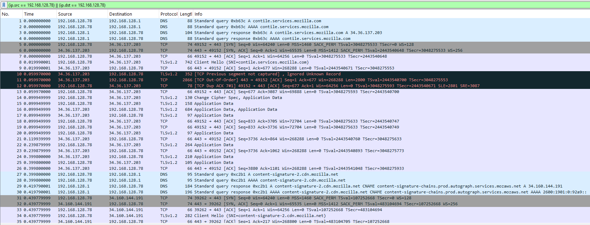
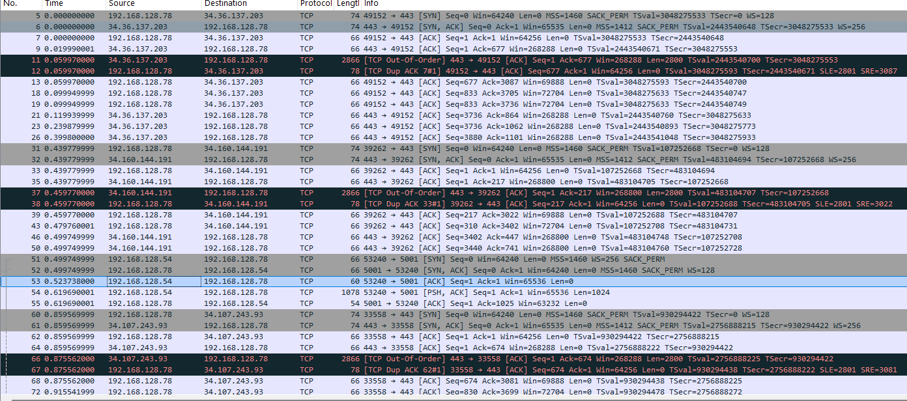
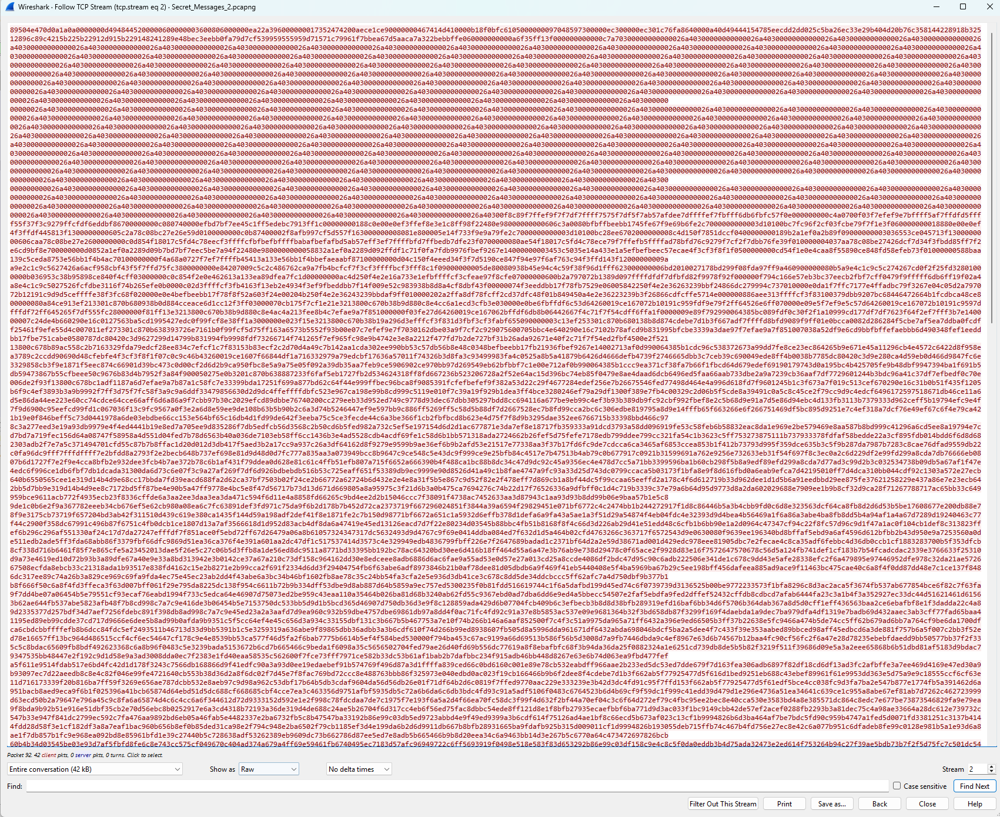

## [forens] Secret Message 2
In this challenge, you will be given a pcap file that stored the typical TCP/IP network traffic.

As the description said, there is an image sent through these packets. So our main job would be filter out the packets that contain the images.
From the first few packets, we can notice that `192.168.128.78` has an active communication with other IP. We can somehow assume that this IP may have an important role in this challenge (Client/ Server?) So we filter it out first.

For our convenience, we may also filter TCP protocol first.

By applying the three filter, we are left with fewer IP address. Scroll down, we may notice an IP `192.168.128.54`. The two IP are in the same subnet, which imply they maybe in the same location. With the given scenario(sender and receiver are siblings), it will be likely what  we are looking for.

Follow the TCP stream, we are able to see a bunch of hex value. On the top left, we are able to see `.PNG`. That indicates we are looking at the hex value of a .png image. So, we can export the image out(Make sure you choose ***Raw***), `save as` and `rename the file as .png`

You can see the flag: cuhk25ctf{Png_N3two1k_40rens13}
