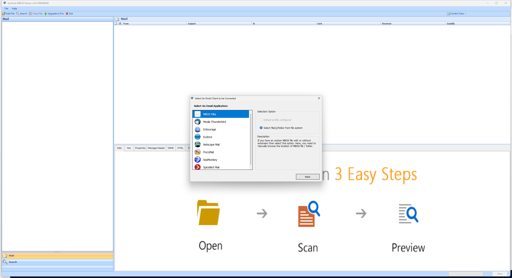
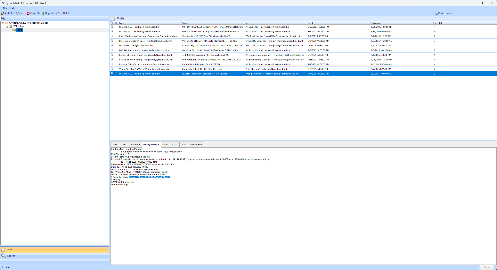

## [forens] ITCL

In this challenge, you will be given a mbox file, which is a plain-text file format that stores a collection of email messages, including their text and attachments.

You can use a email client software to open it(e.g. Gmail, Mozilla Thunderbird, etc...)

This time, I will be using `SysTools MBOX Viewer` to solve this challenge

First, add the `ITCL.mbox` file to the viewer. You should be able to see 11 email intotal.

The next thing to do is to find out which email is the phishing email in the challenge description

You should be able to identify `URGENT: Immediate Password Reset Required` is the malicious email by its email address, senderIP(mismatch with previous ITCL email) and suspicious content.

By performing email header analysis, you will be able to find a weird string:`Y3VoazI1Y3Rme3BoMXNoMW5nX21haTF9`

Decode it with Base64, you will get the flag: `cuhk25ctf{ph1sh1ng_mai1}`