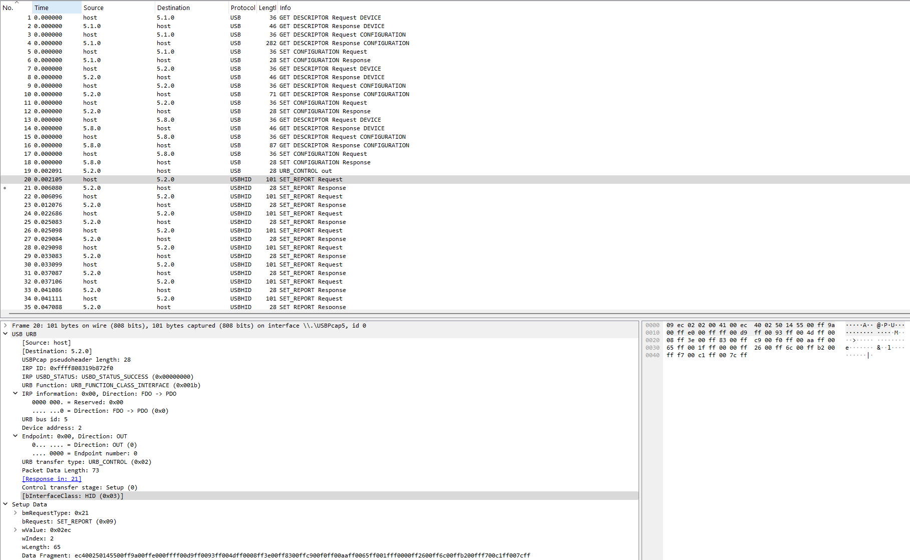
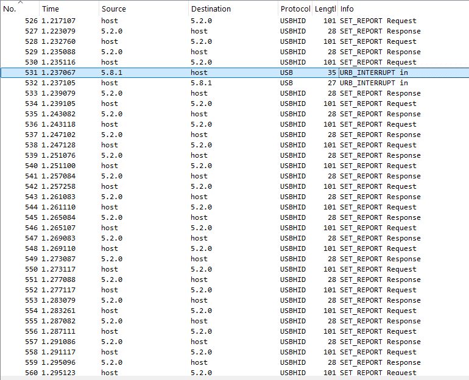
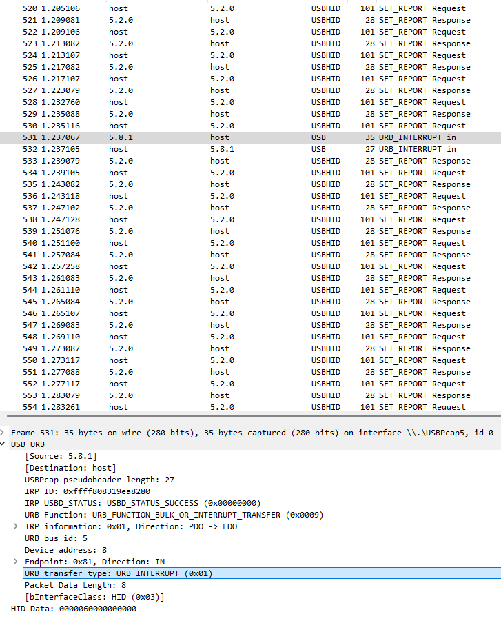
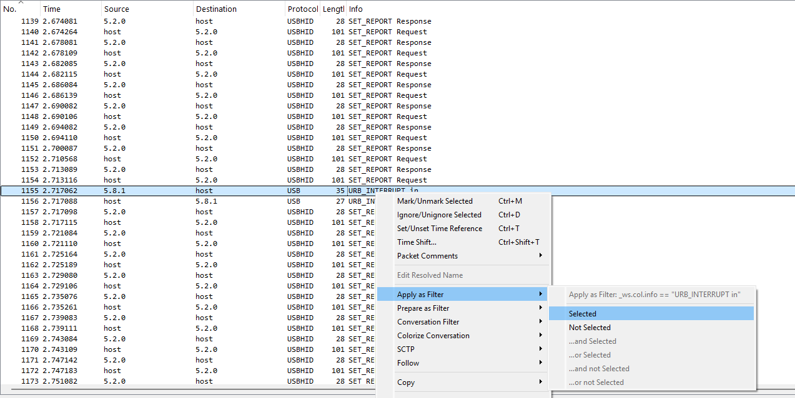
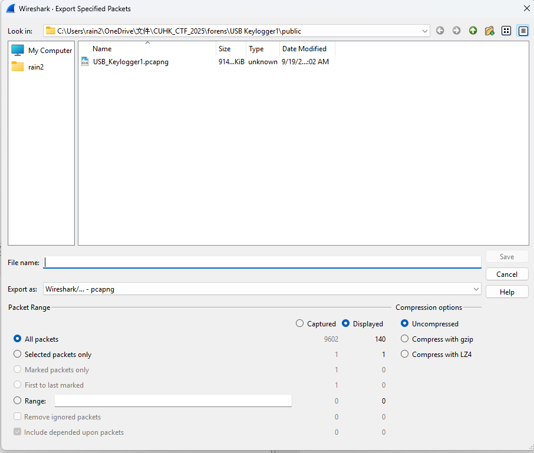

## [forens] USB Keylogger

In this challenge, you will be given a pcap file that contained captured keyboard interupts

By looking at the protocol columne, you should be able to identify this file is mainly USB capture packets.

Click on the packets, you should be able to see bInterfaceClass: HID (0x03). This value imply that the usb device is a input device. 

For example:
Keyboard
Mouse
Joystick or Gamepad
Drawing Tablet
Barcode Scanner (which often identifies as a HID keyboard)
Presentation Clicker
etc.
Then we know we should look for input data.

Scorll down, you should be able the see URB interupt_in packets. That indicated the input data.

URB_INTERRUPT(0x01) indicate the device is a keyboard

You can now see the HID data/ Leftover Capture Data 0000060000000000, that indicate 'c' in keyboard input

ref: https://www.usb.org/sites/default/files/hut1_21_0.pdf page82

extract all the URB interupt_in packets to 1 pcap file

Use tshark to extract the HID data
`tshark -r temp.pcapng -Y "usb.transfer_type == 0x01 && usb.endpoint_address == 0x81" -T fields -e usb.capdata > hid_data.txt`

Use a script(solve.py) to convert the data to characters

you will get the flag: cuhk25ctf{ur_endpoint_is_0x81}