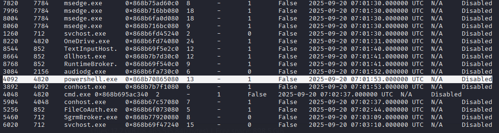
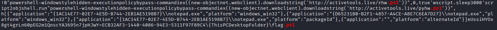
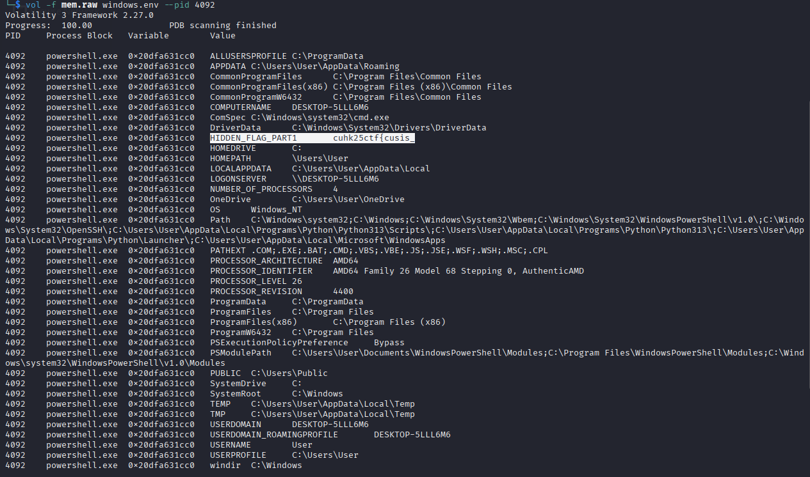
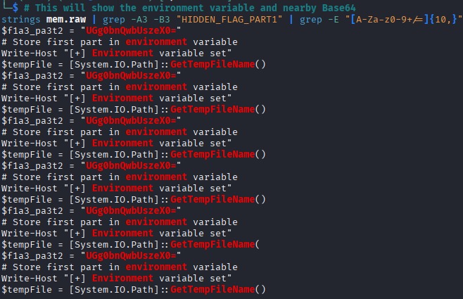
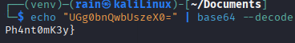

## [forens] RAM hunt

In this challenge, you will be given a mem.raw file, which is a windows RAM dump.
I am going to use Volatility3 to solve this challenge.
First, I will look at what program have been run on the OS
`vol -f mem.raw windows.pslist`

As you can see, powershell ( pid:4092 ) was ran on the OS. Let see look for have it ran a script or what else.
`strings mem.raw | grep -i "\.ps1"`

We can see the `flag.ps1` executed, let check the environment variable of the powershell
`vol -f mem.raw windows.env --pid:4092`

We can see the first part of the flag `cuhk25ctf{cusis_`

Next we can try to see if the part 2 is next to the part1

`strings mem.raw | grep -A3 -B3 "HIDDEN_FLAG_PART1" | grep -E "[A-Za-z0-9+/=]{10,}"`

We can see the second part of the flag `UGg0bnQwbUszeX0=`

Decode with Base64: `Ph4nt0mK3y}`

Flag: `cuhk25ctf{cusis_Ph4nt0mK3y}`

