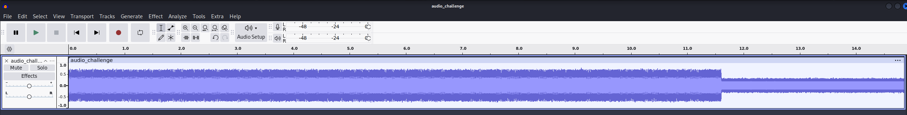
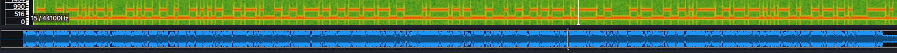

## [forens] Frequency Encoded Secrets

In this challenge, you will be given the `audio_challenge.wav` file.
First, let's open and listen to the file, you should notice a lot of `beep!` sound. This sounds like a Morse Code in telegraph.

(Morse Code: uses sequences of short electrical pulses (dots) and long electrical pulses (dashes) to represent letters, numbers, and punctuation)

Put the file in `Audacity`, you cannot see any useful information in the sound spectrum.

Let's try a common audio steganography approach, spectrogram analysis using `Sonic Visualizer`

You can see there are some fluctuation in the spectrogram. That indicate that the flag maybe stored there. We need to find a way to extract it out.
We assume that up is representing "1" ( ~1000Hz ) and down is representing  "0" ( ~500Hz ), 50ms per bit. We can write a script to extract the data(Or manually decode it if you want `(・∀・)` ). 

You should be able to extract sth like 

`01100011 01110101 01101000 01101011 00110010 00110101 01100011 01110100 
01100110 01111011 00110111 01110111 00110000 01011111 01101100 00110001 
00110011 01101110 01011111 00110000 01101110 00110011 01011111 00110111 
01110101 01110010 00110111 01101000 01111101`

By converting this binary to ASCII gives us the flag

flag: `cuhk25ctf{7w0_l13n_0n3_7ur7h}`

