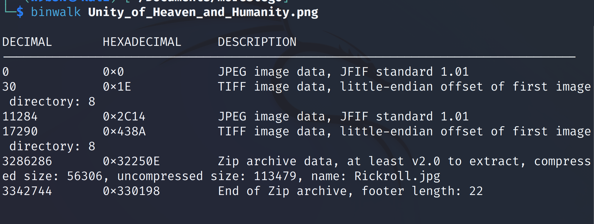
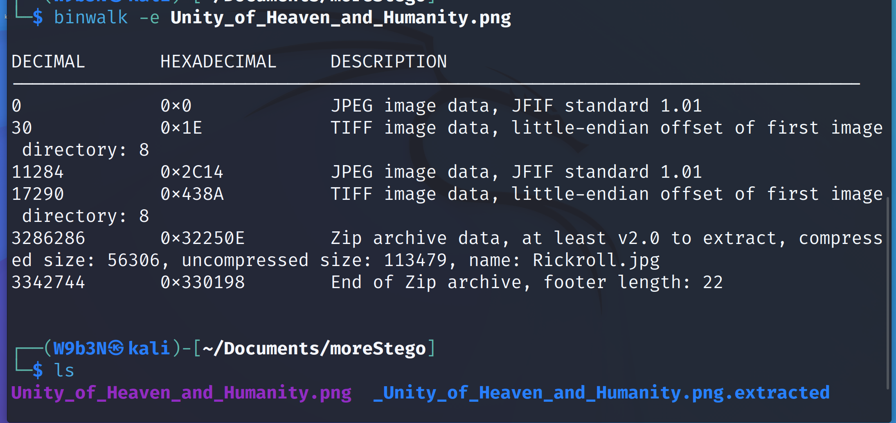
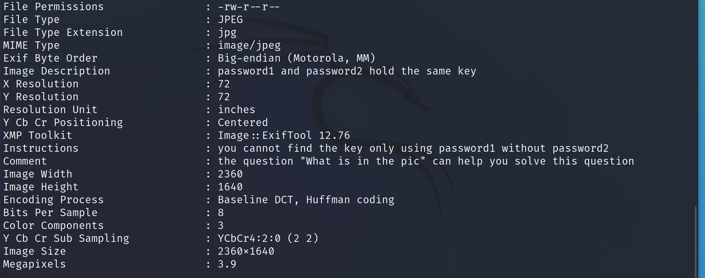
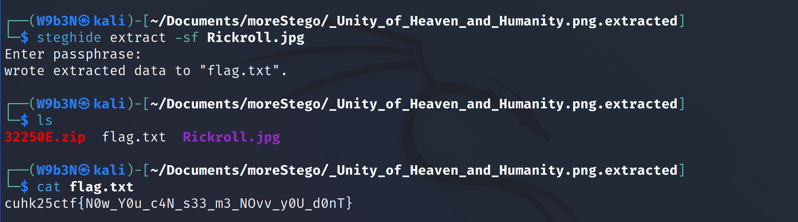

This is a steganography challenge.

The description indicates that the photo should be of a pop star, not the “Unity of Heaven and Humanity” image. This suggests that the pop star's photo might be embedded inside the “Unity of Heaven and Humanity” image. To investigate, we can use binwalk to analyze the file.
 

we can see Rickroll.jpg is zipped. Then, we can use binwalk to extract it out.

Inside the extracted folder, we find the file Rickroll.jpg. To gather more information, I ran exiftool on this image.

Then we find some hints about password1 and password2 using exiftool

After downloading these two files, they appear to contain text that might look like base85 encoded data but aren’t.
Based on the hints, it tell you they hold a same key but need use at the same time to show it out. Thus, you write a script to compare them.

Next you will find the key "interlocking". Refer to the question "What is in the pic", it becomes clear we should use steghide with the extracted Rickroll.jpg and the key interlocking. This successfully extracts the flag.txt file, which contains the flag.

