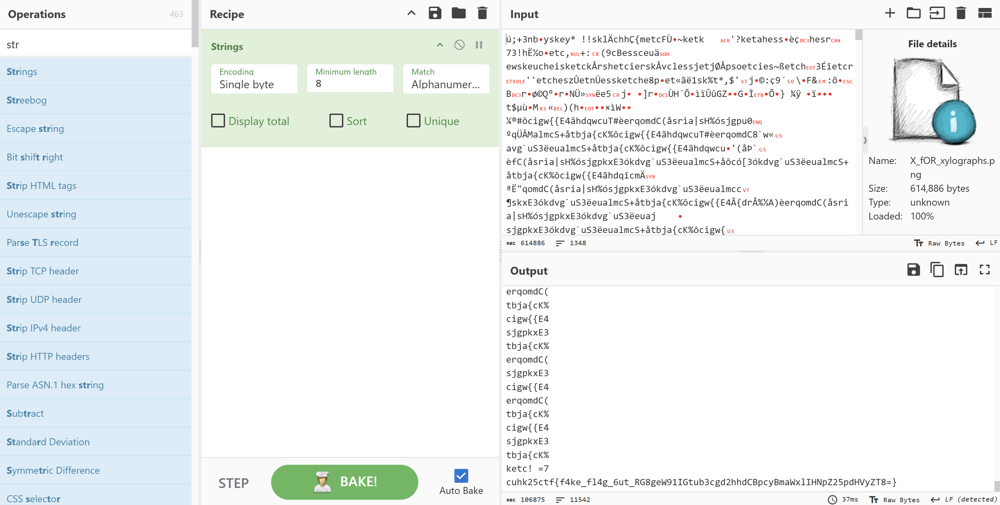
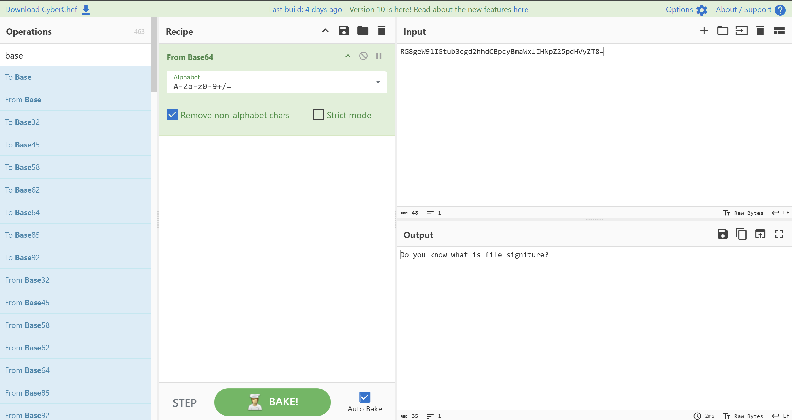
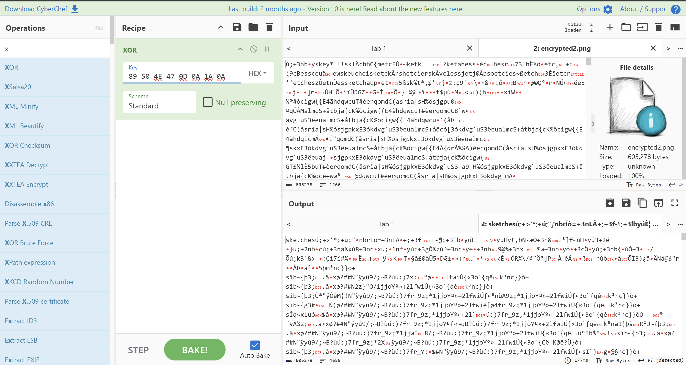
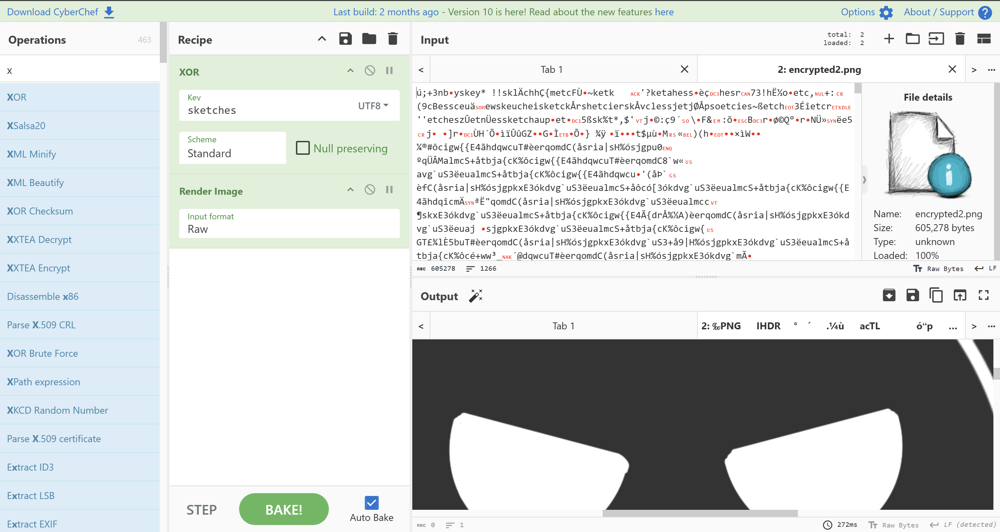

This a a known-plaintext attack on XOR encoding.

I’ve embedded a fake flag inside the PNG file. If you use CyberChef to recover the key, you might see the fake flag. 

Inside the flag, you'll find hints "Do you know what is file signiture?" encoded in Base64.

We know that the file is a PNG image, which means its file signature is always 89 50 4E 47 0D 0A 1A 0A (https://en.wikipedia.org/wiki/List_of_file_signatures). We can use this file signiture to find out the key 
 

The key is "sketches". You can now use this key to decrypt the file again: 
 

After decryption, you’ll notice the file is an animated PNG. You can download it from CyberChef and use ezgif.com to view it: 

You can skip the first frames. Then, by increasing your screen’s brightness or light intensity, the actual flag becomes more visible:
