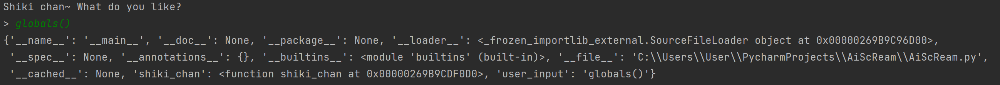
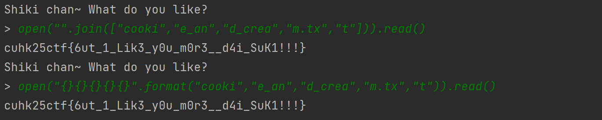

This is a pyjail challenge. We are trying to open {flavor}.txt file

After you watch the video, you will know cookie and cream is Shiki-chan's favorite flavor. Therefore the file name is cookie_and_cream.txt

Let's take a look at the script:
<code>
#!/user/local/bin/python
def shiki_chan(user_input):
    blocked = ["chocolate", "mint", "strawberry", "flavour", "flavor", "cookie", "cream", "COOKIE", "CREAM", "+", "import", "os", "eval", "exec", "flag", "and", "map", "chr", "txt", "lower", "swapcase", "str", "string", "casefold", "capitalize", "title", "bytes", "decode","b"]
    for word in blocked:
        if word in user_input:
            print("Too direct! Plz try again.")
            return
    try:
        print(eval(user_input))
    except Exception as e:
        print(f"Shiki-chan got confused: {e}")

while True:
    print("Shiki chan~ What do you like?")
    user_input = input("> ")
    shiki_chan(user_input)
</code>

According to the function shiki_chan, we know there are a few words are blocked, so we can't type the word directly. However, "+" may give you some hints. You can use string concatenation without "+"(https://www.tutorialspoint.com/How-to-do-string-concatenation-without-plus-operator-in-Python). We can use join() or format().

if we use join():
"".join(["cook","ie_an","d_crea","m.tx","t"])

if we use format():
"{}{}{}{}{}".format("cook","ie_an","d_crea","m.tx","t")

After we solve the word filtering problem, we still need to know how to open the file. In the code, we also use the eval function. The eval() function in Python evaluates a string as a Python expression and returns the result. In this code, it tries to execute the input as Python code. If it works, it prints the result. If it fails (e.g., due to a syntax error), it catches the exception and prints an error message.

First, let’s check what functions we have access to. Python has functions that can be called without importing any modules. We can leverage this to bypass the restriction on the word "import", which is blocked by the script. We can use globals() to see which built-in functions are available to us.

Next, we can refer to [Python’s documentation](https://docs.python.org/3/library/functions.html) to find a list of built-in functions. We see the function [open()](https://docs.python.org/3/library/functions.html#open), which takes in a filename (or path) and a string signifying the mode of operation. open() then returns a [file object](https://docs.python.org/3/glossary.html#term-file-object) that has access to the methods read() and write(). In our case, we’ll want to open “cookie_and_cream.txt” and read the contents, so our expression will look something like this:

open('cookie_and_cream.txt').read()

By combining everything, we can find out the flag:
