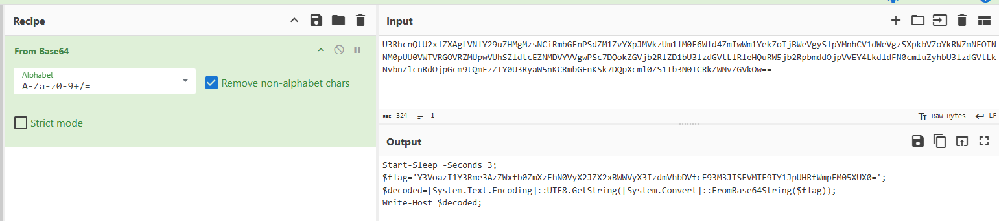

1. Decompile the JAR file online, then found this suspicious variable array. Seems to be integer / ASCII array.


2. Write a solve script to convert from ascii integer to string
Sample script: 
```py
def int_array_to_char_array(int_array):
    # Convert each integer to its corresponding character
    return [chr(i) for i in int_array]

def char_array_to_string(char_array):
    # Join the character array into a single string
    return ''.join(char_array)

# Example usage
int_array = [85, 51, 82, 104, 99, 110, 81, 116, 85, 50, 120, 108, 90, 88, 65, 103, 76, 86, 78, 108, 89, 50, 57, 117, 90, 72, 77, 103, 77, 122, 115, 78, 67, 105, 82, 109, 98, 71, 70, 110, 80, 83, 100, 90, 77, 49, 90, 118, 89, 88, 112, 74, 77, 86, 107, 122, 85, 109, 49, 108, 77, 48, 70, 54, 87, 108, 100, 52, 90, 109, 73, 119, 87, 109, 49, 89, 101, 107, 90, 111, 84, 106, 66, 87, 101, 86, 103, 121, 83, 108, 112, 89, 77, 110, 104, 67, 86, 49, 100, 87, 101, 86, 103, 122, 83, 88, 112, 107, 98, 86, 90, 111, 89, 107, 82, 87, 90, 109, 78, 70, 79, 84, 78, 78, 77, 48, 112, 85, 85, 48, 86, 87, 84, 86, 82, 71, 79, 86, 82, 90, 77, 85, 112, 119, 86, 85, 104, 83, 90, 108, 100, 116, 99, 69, 90, 78, 77, 68, 86, 89, 86, 86, 103, 119, 80, 83, 99, 55, 68, 81, 111, 107, 90, 71, 86, 106, 98, 50, 82, 108, 90, 68, 49, 98, 85, 51, 108, 122, 100, 71, 86, 116, 76, 108, 82, 108, 101, 72, 81, 117, 82, 87, 53, 106, 98, 50, 82, 112, 98, 109, 100, 100, 79, 106, 112, 86, 86, 69, 89, 52, 76, 107, 100, 108, 100, 70, 78, 48, 99, 109, 108, 117, 90, 121, 104, 98, 85, 51, 108, 122, 100, 71, 86, 116, 76, 107, 78, 118, 98, 110, 90, 108, 99, 110, 82, 100, 79, 106, 112, 71, 99, 109, 57, 116, 81, 109, 70, 122, 90, 84, 89, 48, 85, 51, 82, 121, 97, 87, 53, 110, 75, 67, 82, 109, 98, 71, 70, 110, 75, 83, 107, 55, 68, 81, 112, 88, 99, 109, 108, 48, 90, 83, 49, 73, 98, 51, 78, 48, 73, 67, 82, 107, 90, 87, 78, 118, 90, 71, 86, 107, 79, 119, 61, 61]
# Convert int array to char array
char_array = int_array_to_char_array(int_array)
# Convert char array to string
result_string = char_array_to_string(char_array)
print(result_string)
```
3. Result is a Base64-encoded string. Decode it to get a PowerShell script


4. Decode the flag in the $flag variable using Base64 decoding
